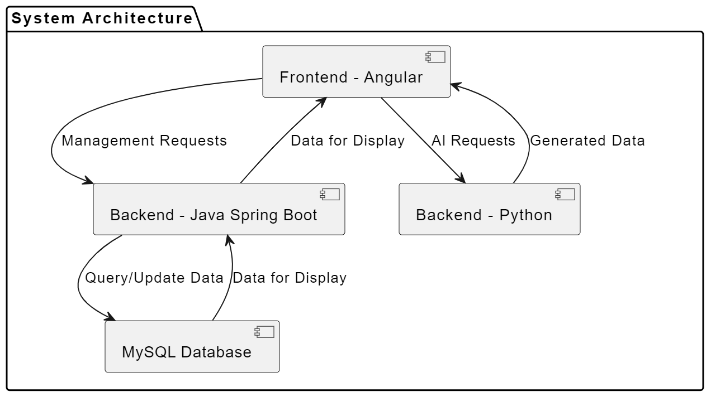
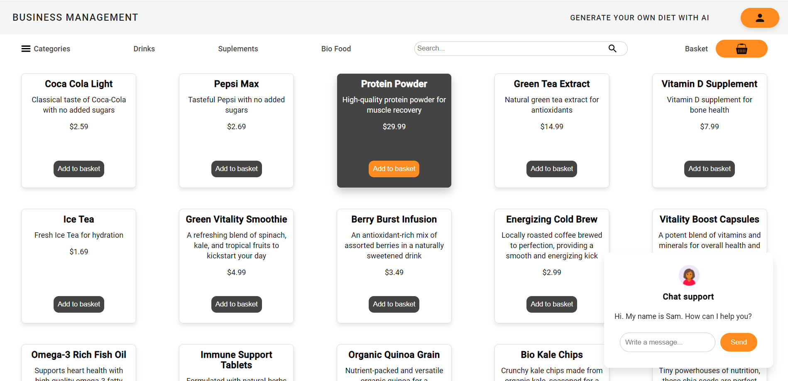
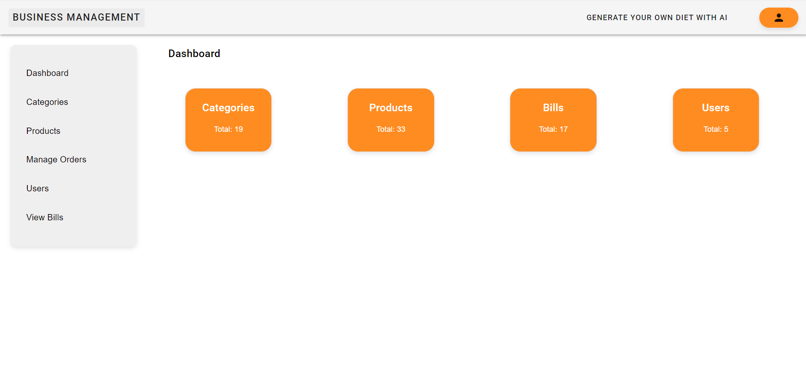

# Web App Management System with Elements of AI

## Project Overview

This web-based application for business management integrates selected 
elements of artificial intelligence (AI) to deliver intelligent and 
personalized solutions. The project was developed as an engineering 
thesis at Politechnika Łódzka during winter semester 2023/2024.

## Project Structure

The project is structured into three main components:

1. **Management System Backend (Java Spring Boot) with MySQL connection:**
    - Located in the `managementsystem` directory.
    - Implements core business logic, REST APIs, and database interactions.

2. **Frontend (Angular):**
    - Located in the `frontend` directory.
    - Implements the user interface and interacts with the backend APIs.

3. **AI Backend (Python):**
    - Located in the `chatbot` directory.
    - Implements AI-driven chatbot functionality.
    - Located in the `recommnedation-system` directory.
    - Implements AI-driven recommendation system functionality.

### Project Architecture
Below is displayed my project's general architecture.

## Getting Started

To run the project locally, follow these steps:

1. Clone the repository: `git clone <repository-url>`
2. Navigate to the project directory: `cd Web-App-Management-System`

## Dockerized Deployment
To deploy the entire system using Docker, use the provided docker-compose.yml file:

Copy code: `docker-compose up`. It will orchestrate containers for the 
management system with mysql,  frontend, chatbot, and recommendation 
system for easier access.

## Initial interaction

When users first enters the page, they are welcomed with the home page:

However, when admin logs in, he can see a dashboard page for management of the system, in which admin can use CRUD operations for all elements.

## License

All copyrights for this project belong to Politechnika Łódzka.

© 2024 Politechnika Łódzka. All Rights Reserved.
